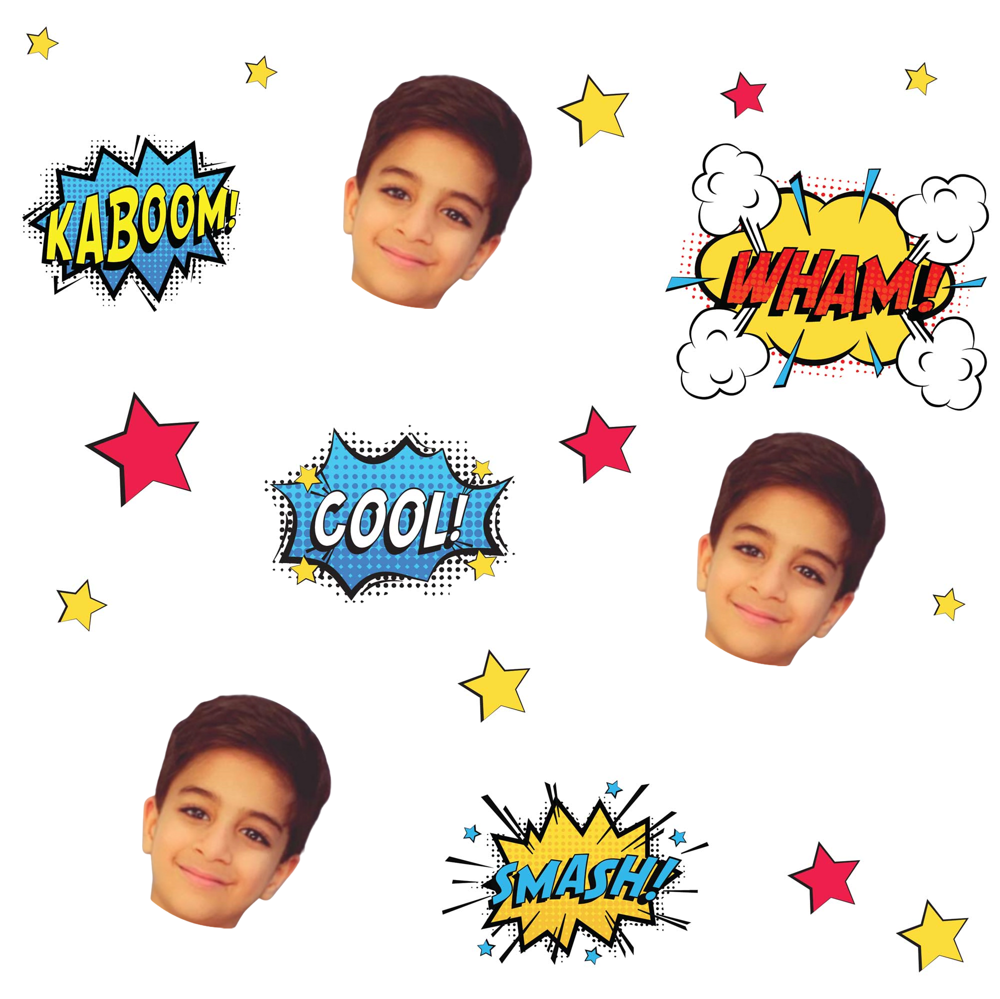

# Gift Wrap Challenge

Given a gift box with size [width: 15 cm, height: 10 cm, length: 5 cm] and we want to print a wrapping paper to wrap this box.
You will have a pattern that we need to repeat one more time for generating the wrapping paper.

## Example

#### Pattern example:

#### Generated file example output:
[Generated PDF file](./generated-file.pdf)

## Notes
- Estimate the paper size in cm2 based on the given box size. make it fit the box and convert it to pixels.

- Generate wrapping paper by repeating the given pattern one more time until it fit the estimated size.

## Requirements
1- The generated file extension must be PDF.

2- The file DPI must be 200.

3- Use any file uploader service that upload the file and just return the file URL.

## Restrictions

- Use NodeJS
- Introduce your solution in a Github repository.
- Write documentation for the project with a running demo.

## Considerations for the challenge review
- Deadline
- Clear functionality
- Code quality
- The file generation speed
